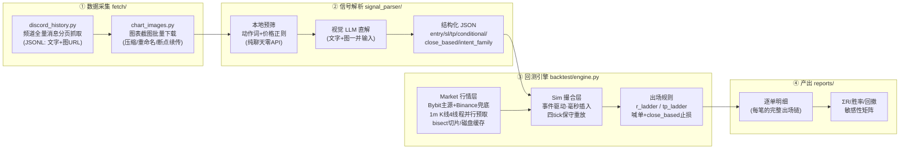
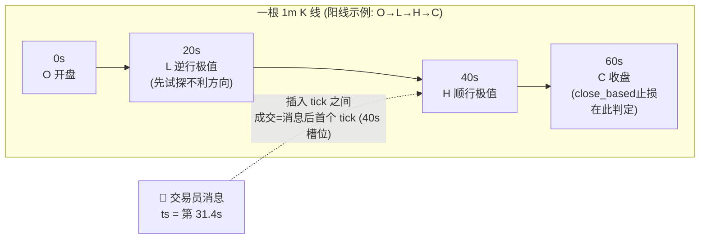

# Signal Vision Backtest — AI 视觉信号解析 + 秒级回测引擎

基于 Python 的交易员频道信号研究工具链：把 Discord/Telegram 频道里的**文字 + 图表截图**交给视觉大模型（GLM / Qwen-VL / GPT-4o 等任意 OpenAI 兼容接口）解析成结构化交易指令，再以**秒级时间轴**在 1 分钟 K 线上逐条回放，回答一个核心问题——

> **"如果当时跟了这位交易员，会怎么样？"**

> ⚠️ **风险提示**：本项目仅作为技术工具与研究成果，**不构成任何投资建议**。
> 自动化使用个人账号访问 Discord 违反其 ToS，请自行评估；自动交易风险极高，
> 回测表现不代表真实盘结果（滑点、深度、延迟均会让实盘劣于回测）。

## 一、为什么需要"视觉"解析

真实交易员频道的信号有三个特征，纯文本/正则方案必然失败——这是我们对多个真实频道约两年历史逐条回测的实测结论：

1. **价位在图上**：止损/止盈经常只以红线/绿线画在 TradingView 截图里。实测某频道 **64% 的信号止损只存在于图上**，纯文本解析等于直接丢掉 2/3 的信号；
2. **口语化混合指令**："现价 1038 短多，止盈 1135 平一半，成本防守，980 补，945 止损"——一句话包含市价入场 + 分批止盈 + 保本移损 + DCA 补仓腿 + 硬止损五种语义；
3. **收盘价止损**："4H 收盘跌破 1865 才空"——盘中插针不算触发。**是否建模这一条，同一套信号的回测结果相差数十个 R**；
4. **图文错配与战报**：交易员会发错图/引用旧图；"booked +6R"式战报帖会被 naive 正则管线当成新开仓交易。

## 二、功能特性

- **视觉直解**：文字 + 图表一并交给视觉大模型，输出结构化 JSON（symbol / side / entry / sl / tp_levels / order_type）；文字数字优先，图只补缺与纠错（逐位读标签并与价格轴刻度交叉核对）
- **本地预筛**：免费的动作词+价格正则门禁，纯聊天/科普帖不打 API
- **信号语义打标**：
  - `conditional`——条件单（"出现 X 情况则右侧做空"），按挂单语义只在触发价成交，48h 未触发计为未成交
  - `stop_trigger_type=close_based`——收盘价止损（"4H 收盘跌破"），回测只在对应周期收盘 tick 判定，**盘中插针不触发**
  - `intent_family`——OPEN / RESULT / ANALYSIS / NOISE 四族分类，战报帖与教学帖不会污染回测
- **秒级事件驱动回测**：每根 1m K 线展开为 开盘(0s) → 逆行极值(20s) → 顺行极值(40s) → 收盘(60s) 四个 tick，消息按原始毫秒时间戳插入 tick 之间；成交=消息后首个 tick（保守重放设计致敬 [VeloTradeX](https://github.com/VeloTradeX/velotradex)，MIT）
- **两种出场规则对照**（`SVB_RULE`）：
  - `r_ladder`（默认）：**+1R 平 40% 并移保本 → +2R 再平 40% → 剩余 20% 只听喊单**
  - `tp_ladder`：完全按交易员公布的止盈位执行，N 档各平 1/N
- **真实成本建模**：市价/止损单滑点（可调档做敏感性矩阵）、taker 手续费、按持仓期逐段计入真实资金费率
- **工程细节**：行情/图片/消息三类出口全部域名白名单 + 解析 IP 私网拦截 + 禁重定向；K 线 4 线程并行预取 + bisect 切片；内存占位可控（长历史不 OOM）
- **可审计**：语料/信号/管理消息 SHA256 审计哈希，任何口径改动都可追溯
- **漏检检测器**：`signal_parser/missed_detector.py` 自动扫描解析后仍疑似含开仓指令的纯文字消息，量化信号覆盖率缺口

## 三、回测规则对照（为什么要做两种）

同一批入场信号，只换出场规则，我们对多位真实交易员约两年历史的对照结果：

| 出场规则 | 交易员 A | 交易员 B |
|---|---|---|
| `r_ladder`（R 值管理） | **+6.1R**（胜率 60%，回撤 -8.0R） | **+47.5R**（胜率 55%，回撤 -5.5R） |
| `tp_ladder`（照抄交易员自设止盈止损） | **-17.7R**（胜率 27.5%，回撤 -31.1R） | — |

- **进场有优势 ≠ 自设止盈位是最优出场**。两位交易员自设的止盈位普遍挂在 2–4R 开外，价格在止损前到达 TP1 的频率不足以覆盖回撤单；
- 标准化的"早落袋 + 保本"纪律把进场优势兑现成曲线，而照抄指令把同一优势浪费在够不到的远端止盈上；
- 交易员后续的**喊单**（移损/部分止盈/全平）在两种规则下都作为离场事件保留。

## 三、系统架构

### 3.1 数据流总览



### 3.2 撮合时间轴（1 分钟 K 线 → 4 tick）



- 阳线走 `O→L→H→C`、阴线走 `O→H→L→C`——同根 K 线内**先试探对持仓不利的方向**，
  避免"TP/SL 同根 K 线永远先成 TP"的乐观偏差（保守重放设计致敬
  [VeloTradeX](https://github.com/VeloTradeX/velotradex)，MIT）；
- 交易员的后续喊单（移损/分批止盈/全平）与资金费时点同样按毫秒插入，
  作用于当时仍持有的仓位。

### 3.3 组件说明

| 组件 | 文件 | 职责 | 关键设计 |
|---|---|---|---|
| 频道抓取 | `fetch/discord_history.py` | 分页拉取频道全量消息 → JSONL | 域名白名单 + 解析 IP 私网拦截 + 禁重定向 + 429 退避 |
| 图表下载 | `fetch/chart_images.py` | 附件图批量下载压缩（≤1280px） | CDN 白名单；签名 URL 过期前及时抓取 |
| 信号解析 | `signal_parser/parser.py` | 文字+图 → 结构化 JSON | 本地预筛省 API；文字数字优先、图只补缺纠错；四族分类过滤战报/教学帖 |
| 行情层 `Market` | `backtest/engine.py` | 合约解析 + 1m K 线缓存 + tick 展开 | Bybit 主源 Binance 兜底；4 线程并行预取 + 条件变量等待；缺口分段补拉；非活跃标的内存驱逐 |
| 撮合层 `Sim` | `backtest/engine.py` | 事件驱动持仓管理 | R 阶梯/TP 阶梯双规则；喊单三类动作（止盈/移损/全平）秒级生效；资金费逐期计入；30 天持仓上限 |
| 报告 | `backtest/engine.py` | 逐单明细 + ΣR/胜率/回撤 | 出场链完整可溯（每笔含 1R/2R/喊单/止损的精确时点） |

## 四、快速开始

```bash
pip install -r requirements.txt

# 1) 配置（OpenAI 兼容视觉模型 + Discord 账号 token）
export SIGNAL_API_KEY=...
export SIGNAL_API_BASE=https://open.bigmodel.cn/api/paas/v4
export SIGNAL_MODEL=glm-4.5v
export DISCORD_TOKEN=...

# 2) 拉取频道历史 + 图表
python -m fetch.discord_history <channel_id> data/channel.jsonl
python -m fetch.chart_images data/channel.jsonl data/images/

# 3) 解析一条信号（文字 + 图）
python -m signal_parser --text "long ETH at cmp, 4h close under 1865 stops, tp 1750" --image chart.jpg

# 4) 回放（WORK 目录下准备 signals.json / manages.json，样例见 examples/）
export SVB_WORK=./work
python backtest/engine.py sim
python backtest/engine.py report
```

### 环境变量

| 变量 | 说明 | 默认 |
|---|---|---|
| `SIGNAL_API_KEY` / `SIGNAL_API_BASE` / `SIGNAL_MODEL` | LLM API（强制 https） | GLM 官方端点 / glm-4.5v |
| `DISCORD_TOKEN` | Discord 账号 token（仅本地使用，勿提交） | — |
| `SVB_WORK` | 回测工作目录（signals/manages/K线缓存） | `./work` |
| `SVB_RULE` | 出场规则：`r_ladder` / `tp_ladder` | `r_ladder` |
| `SVB_RISK_USDT` | 每单固定风险（U） | `25` |
| `SVB_SLIP` | 市价/止损单滑点（每边，做敏感性矩阵用） | `0.0005` |
| `GR1_LVL` / `GR1_FRAC` / `GR2_LVL` / `GR2_FRAC` | R 阶梯参数 | `1.0 / 0.40 / 2.0 / 0.40` |

## 五、信号 JSON 格式

见 [`examples/`](examples/)。核心字段：

```jsonc
{
  "symbol": "ETH", "side": "SHORT",
  "order_type": "MARKET",            // MARKET=现价; LIMIT=挂单/区间
  "entry_prices": [1865],            // 多腿区间全列
  "sl": 1892, "sl_source": "text",   // 止损来源: text(文字) / chart(图读)
  "stop_trigger_type": null,         // "close_based" = 收盘价止损
  "stop_timeframe": "4H",
  "conditional": true,               // 条件单: 满足条件才进场
  "tp_levels": [1820]
}
```

## 六、实测教训（二次回测前的必修课）

| 教训 | 后果（若不做） |
|---|---|
| **纯文字口语开仓单漏检** | 实测某频道 53 条纯文字开仓指令被管线遗漏（默认只送管理解析不送开仓解析）；已加 `missed_detector.py` 量化缺口 |
| **回复引用消息内嵌新单漏检** | 交易员在"回复引用旧单"的正文里发新单（如"昨天挂单取消 + 轻仓介入 85200-85600"），只解析引用头会整类漏掉；实测补录 61 条（46→88 笔平仓），结论方向都被改变 |
| **管理消息字段键名对齐** | 生产解析产出 `new_sl`，回测引擎只认 `new_stop`/`stop_price` → 显式移损价被静默退化成保本价（实测 13/30 条移损受影响）；字段映射要有对账用例 |
| 图上止损必须视觉解析 | 丢掉 2/3 信号，且漏掉的恰是质量最高的部分 |
| 收盘价止损按周期收盘判定 | 正期望策略在回测里变负（插针误杀） |
| 战报/教学帖过滤（AI 四族分类） | "+6R booked"被当新开仓，虚增胜率与利润 |
| 限价挂在可立即成交一侧按市价处理 | 大量"CMP till X"信号被误判 48h 未成交 |
| 同批信号跑双出场规则 | 无法区分"进场有优势"与"出场占便宜" |
| 同频道不同时期可能不是同一交易员 | 文体指纹按季检验；全历史数字不能视为同一人的战绩 |

## 七、免责声明

本项目仅作为**技术工具与研究成果**，不构成任何投资建议。自动交易风险极高，可能导致本金全部损失；回测存在撮合近似（1m 四 tick）、滑点假设、退市标的缺失等已知偏差，回测表现不代表真实盘结果。使用本工具抓取 Discord 内容请自行确认符合 Discord 服务条款及当地法律法规。信号内容的知识产权属于原发布者，请勿在未授权情况下转发或商用其信号。

## License

MIT
