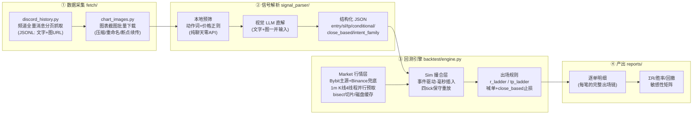
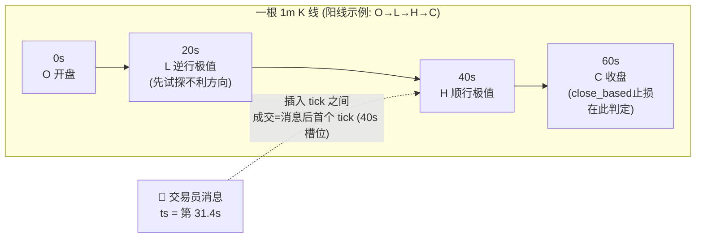

# Signal Vision Backtest — AI 视觉信号解析 + 秒级回测引擎

基于 Python 的交易员频道信号研究工具链：把 Discord/Telegram 频道里的**文字 + 图表截图**交给视觉大模型（GLM / Qwen-VL / GPT-4o 等任意 OpenAI 兼容接口）解析成结构化交易指令，再以**秒级时间轴**在 1 分钟 K 线上逐条回放，回答一个核心问题——

> **"如果当时跟了这位交易员，会怎么样？"**

> ⚠️ **风险提示**：本项目仅作为技术工具与研究成果，**不构成任何投资建议**。
> 自动化使用个人账号访问 Discord 违反其 ToS，请自行评估；自动交易风险极高，
> 回测表现不代表真实盘结果（滑点、深度、延迟均会让实盘劣于回测）。

## 一、为什么需要"视觉"解析

真实交易员频道的信号有三个特征，纯文本/正则方案必然失败——这是我们对多个真实频道约两年历史逐条回测的实测结论：

1. **价位在图上**：止损/止盈经常只以红线/绿线画在 TradingView 截图里。实测某频道 **64% 的信号止损只存在于图上**，纯文本解析等于直接丢掉 2/3 的信号；
2. **口语化混合指令**："现价 1038 短多，止盈 1135 平一半，成本防守，980 补，945 止损"——一句话包含市价入场 + 分批止盈 + 保本移损 + DCA 补仓腿 + 硬止损五种语义；
3. **收盘价止损**："4H 收盘跌破 1865 才空"——盘中插针不算触发。**是否建模这一条，同一套信号的回测结果相差数十个 R**；
4. **图文错配与战报**：交易员会发错图/引用旧图；"booked +6R"式战报帖会被 naive 正则管线当成新开仓交易。

## 二、功能特性

- **视觉直解**：文字 + 图表一并交给视觉大模型，输出结构化 JSON（symbol / side / entry / sl / tp_levels / order_type）；文字数字优先，图只补缺与纠错（逐位读标签并与价格轴刻度交叉核对）
- **本地预筛**：免费的动作词+价格正则门禁，纯聊天/科普帖不打 API
- **信号语义打标**：
  - `conditional`——条件单（"出现 X 情况则右侧做空"），按挂单语义只在触发价成交，48h 未触发计为未成交
  - `stop_trigger_type=close_based`——收盘价止损（"4H 收盘跌破"），回测只在对应周期收盘 tick 判定，**盘中插针不触发**
  - `intent_family`——OPEN / RESULT / ANALYSIS / NOISE 四族分类，战报帖与教学帖不会污染回测
- **秒级事件驱动回测**：每根 1m K 线展开为 开盘(0s) → 逆行极值(20s) → 顺行极值(40s) → 收盘(60s) 四个 tick，消息按原始毫秒时间戳插入 tick 之间；成交=消息后首个 tick（保守重放设计致敬 [VeloTradeX](https://github.com/VeloTradeX/velotradex)，MIT）
- **单标的喊话频道模板**：黄金/外汇 CFD 类"单一标的 + 高频喊话事件流"频道用 [`backtest/voice_event_engine.py`](backtest/voice_event_engine.py)——1R 出场动作（全平/平半+保本/只保本）、获利了结/移保本/全平三类喊话、固定手数或固定风险定量，见[第九节](#九单一标的喊话频道事件驱动回测模板)
- **两种出场规则对照**（`SVB_RULE`）：
  - `r_ladder`（默认）：**+1R 平 40% 并移保本 → +2R 再平 40% → 剩余 20% 只听喊单**
  - `tp_ladder`：完全按交易员公布的止盈位执行，N 档各平 1/N
- **真实成本建模**：市价/止损单滑点（可调档做敏感性矩阵）、taker 手续费、按持仓期逐段计入真实资金费率
- **工程细节**：行情/图片/消息三类出口全部域名白名单 + 解析 IP 私网拦截 + 禁重定向；K 线 4 线程并行预取 + bisect 切片；内存占位可控（长历史不 OOM）
- **可审计**：语料/信号/管理消息 SHA256 审计哈希，任何口径改动都可追溯
- **漏检检测器**：`signal_parser/missed_detector.py` 自动扫描解析后仍疑似含开仓指令的纯文字消息，量化信号覆盖率缺口

## 三、回测规则对照（为什么要做两种）

同一批入场信号，只换出场规则，我们对多位真实交易员约两年历史的对照结果：

| 出场规则 | 交易员 A | 交易员 B |
|---|---|---|
| `r_ladder`（R 值管理） | **+6.1R**（胜率 60%，回撤 -8.0R） | **+47.5R**（胜率 55%，回撤 -5.5R） |
| `tp_ladder`（照抄交易员自设止盈止损） | **-17.7R**（胜率 27.5%，回撤 -31.1R） | — |

- **进场有优势 ≠ 自设止盈位是最优出场**。两位交易员自设的止盈位普遍挂在 2–4R 开外，价格在止损前到达 TP1 的频率不足以覆盖回撤单；
- 标准化的"早落袋 + 保本"纪律把进场优势兑现成曲线，而照抄指令把同一优势浪费在够不到的远端止盈上；
- 交易员后续的**喊单**（移损/部分止盈/全平）在两种规则下都作为离场事件保留。

## 四、系统架构

### 3.1 数据流总览



### 3.2 撮合时间轴（1 分钟 K 线 → 4 tick）



- 阳线走 `O→L→H→C`、阴线走 `O→H→L→C`——同根 K 线内**先试探对持仓不利的方向**，
  避免"TP/SL 同根 K 线永远先成 TP"的乐观偏差（保守重放设计致敬
  [VeloTradeX](https://github.com/VeloTradeX/velotradex)，MIT）；
- 交易员的后续喊单（移损/分批止盈/全平）与资金费时点同样按毫秒插入，
  作用于当时仍持有的仓位。

### 3.3 组件说明

| 组件 | 文件 | 职责 | 关键设计 |
|---|---|---|---|
| 频道抓取 | `fetch/discord_history.py` | 分页拉取频道全量消息 → JSONL | 域名白名单 + 解析 IP 私网拦截 + 禁重定向 + 429 退避 |
| 图表下载 | `fetch/chart_images.py` | 附件图批量下载压缩（≤1280px） | CDN 白名单；签名 URL 过期前及时抓取 |
| 信号解析 | `signal_parser/parser.py` | 文字+图 → 结构化 JSON | 本地预筛省 API；文字数字优先、图只补缺纠错；四族分类过滤战报/教学帖 |
| 行情层 `Market` | `backtest/engine.py` | 合约解析 + 1m K 线缓存 + tick 展开 | Bybit 主源 Binance 兜底；4 线程并行预取 + 条件变量等待；缺口分段补拉；非活跃标的内存驱逐 |
| 撮合层 `Sim` | `backtest/engine.py` | 事件驱动持仓管理 | R 阶梯/TP 阶梯双规则；喊单三类动作（止盈/移损/全平）秒级生效；资金费逐期计入；30 天持仓上限 |
| 报告 | `backtest/engine.py` | 逐单明细 + ΣR/胜率/回撤 | 出场链完整可溯（每笔含 1R/2R/喊单/止损的精确时点） |
| 喊话频道模板 | `backtest/voice_event_engine.py` | 单标的(黄金/外汇 CFD)事件流回测 | +1R 动作四档参数；喊话事件三类；市价型信号首 bar 成交；腿级记账 |

## 五、快速开始

```bash
pip install -r requirements.txt

# 1) 配置（OpenAI 兼容视觉模型 + Discord 账号 token）
export SIGNAL_API_KEY=...
export SIGNAL_API_BASE=https://open.bigmodel.cn/api/paas/v4
export SIGNAL_MODEL=glm-4.5v
export DISCORD_TOKEN=...

# 2) 拉取频道历史 + 图表
python -m fetch.discord_history <channel_id> data/channel.jsonl
python -m fetch.chart_images data/channel.jsonl data/images/

# 3) 解析一条信号（文字 + 图）
python -m signal_parser --text "long ETH at cmp, 4h close under 1865 stops, tp 1750" --image chart.jpg

# 4) 回放（WORK 目录下准备 signals.json / manages.json，样例见 examples/）
export SVB_WORK=./work
python backtest/engine.py sim
python backtest/engine.py report
```

### 环境变量

| 变量 | 说明 | 默认 |
|---|---|---|
| `SIGNAL_API_KEY` / `SIGNAL_API_BASE` / `SIGNAL_MODEL` | LLM API（强制 https） | GLM 官方端点 / glm-4.5v |
| `DISCORD_TOKEN` | Discord 账号 token（仅本地使用，勿提交） | — |
| `SVB_WORK` | 回测工作目录（signals/manages/K线缓存） | `./work` |
| `SVB_RULE` | 出场规则：`r_ladder` / `tp_ladder` | `r_ladder` |
| `SVB_RISK_USDT` | 每单固定风险（U） | `25` |
| `SVB_SLIP` | 市价/止损单滑点（每边，做敏感性矩阵用） | `0.0005` |
| `GR1_LVL` / `GR1_FRAC` / `GR2_LVL` / `GR2_FRAC` | R 阶梯参数 | `1.0 / 0.40 / 2.0 / 0.40` |

## 六、信号 JSON 格式

见 [`examples/`](examples/)。核心字段：

```jsonc
{
  "symbol": "ETH", "side": "SHORT",
  "order_type": "MARKET",            // MARKET=现价; LIMIT=挂单/区间
  "entry_prices": [1865],            // 多腿区间全列
  "sl": 1892, "sl_source": "text",   // 止损来源: text(文字) / chart(图读)
  "stop_trigger_type": null,         // "close_based" = 收盘价止损
  "stop_timeframe": "4H",
  "conditional": true,               // 条件单: 满足条件才进场
  "tp_levels": [1820]
}
```

## 七、正则解析（刚性格式频道的另一条路）

> 适用前提：频道格式规整（标的+方向+区间+SL+TP 阶梯）。自由文本与图表请回到视觉解析主线——两者是分工不是替代。

### 为什么正则优先

同一 112 条人工核验信号集的实测对比：

| 解析方式 | 覆盖 | 单条成本 |
|---|---|---|
| AI 文本直解 | 109/111 | 每条一次 API 调用 |
| 字段化正则（三层） | **111/111** | **零** |

图表止损仍必须视觉解析（见第一章）；但文字区单正则可以全包，AI 只兜底未知格式。

### 三层解析架构

```
消息 ─► ① 主正则（频道方言语法，见下表）
     ─► ② 独立校验器（同一语法的第二实现，与①互查漏）──命中──┐
     ─► ③ AI 兜底（仅当含 SL/止损字样且①②都没吃下）────────┴─► 开仓参数
管理消息 ─► 动作词表（见下）──► partial / move_be / close_all / add_dca / cancel_dca / cancel_legs
```

### 方言语法表（全部真实样本实证）

| 变体 | 示例 | 处理要点 |
|---|---|---|
| 标的方向连写 | `BTC空 114200-114800` | 边界断言只排除 ASCII——中文是 unicode word 字符，`\b` 会失配 |
| 入场三形态 | `82200-82700` / `78500 上下200点` / `109700附近`、`现价89700左右` | 区间 / 中心±偏移 / 单点 |
| 分批腿 | `110600-111000 / 补仓109200`、`87800第一注 / 86000第二注` | 解析为多入场腿 |
| 繁简混写 | `止損` `現價` `補倉點` | 正则字符集双收 |
| 回复引用内嵌新单 | `> 回复 @…[旧单预览…](url)` + 正文新单 | 引用行整行剥离（预览含旧 SL/价格会截胡），正文重走开仓解析 |
| 方向词在标的前 | `反手做空 BTC…`、`多比特币…` | 方向词搜索窗口包含标的前短语 |
| 区间笔误 | `60900-91300`（3 分钟后自行更正为 60900-61300） | 跨度 >10% 拒收，等修正版 |
| TP 笔误 | SHORT 单 TP 方向写反 | 保留信号、TP 置空并标记异常，不拒收 |
| 纯市价单 | `btc 多 / 现价 / sl 89000` | 无入场价，规则化跟单无法挂限价 → 推人工 |

### 管理动作词表（触发原话均为实测）

| 动作 | 实测触发原话 |
|---|---|
| partial | `先吃30%` / `当tp1止盈50%` / `再止盈一部分`（比例未说 → 默认 30% 并标记） |
| move_be / stop_move | `止损移到开单点` / `睡前止损要上移到85400` / `SL 统一修改为113000` |
| close_all | `可以全部止盈` / `先离场` |
| add_dca | `加一个补仓点 112200`（可同帧带统一移损；"补仓后均价X"是状态播报，价格不紧跟补仓点就不算动作） |
| cancel_dca | `取消补仓`（常与移保本同发） |
| cancel_legs | `没进到，取消` |
| tp_hit | `TP1到了` → 保本节奏听交易员播报，不跟自己的成交 |

### 语料回归方法论

1. 人工核验信号集当 ground truth（逐条对过 K 线确认真实成交）；
2. 正则任何改动跑**全量历史语料回放**：覆盖率不得下降、误报必须为零；
3. **两套独立实现对跑**互相查漏——实测从 93/111 补到 111/111 的差距全是这么找出来的；
4. 解析层识别 ≠ 执行层跟单：无 TP 单、纯市价单被完整识别后仍按策略推人工，两层职责分开。

### 与 VeloTradeX 的分工（不重复造轮子）

上游 [VeloTradeX](https://github.com/VeloTradeX/velotradex)（MIT）已有按频道定制的正则解析器族（`GaulsParser`/`KacangParser`/`MansoorParser`/`WWGParser` + AI 兜底），生产链路直接沿用该架构。本节沉淀的是上游尚无的增量：引用内嵌新单（上游把"有引用"一律当旧仓管理上下文）、DCA 动作族、状态播报消歧、笔误护栏与两层对跑方法论。

## 八、实测教训（二次回测前的必修课）

| 教训 | 后果（若不做） |
|---|---|
| **纯文字口语开仓单漏检** | 实测某频道 53 条纯文字开仓指令被管线遗漏（默认只送管理解析不送开仓解析）；已加 `missed_detector.py` 量化缺口 |
| **回复引用消息内嵌新单漏检** | 交易员在"回复引用旧单"的正文里发新单（如"昨天挂单取消 + 轻仓介入 85200-85600"），只解析引用头会整类漏掉；实测补录 61 条（46→102 笔平仓），结论方向都被改变 |
| **管理消息字段键名对齐** | 生产解析产出 `new_sl`，回测引擎只认 `new_stop`/`stop_price` → 显式移损价被静默退化成保本价（实测 13/30 条移损受影响）；字段映射要有对账用例 |
| **中途补仓/取消补仓是独立管理动作** | 只建模 partial/be/close 的话，"加一个补仓点 112200 / SL统一修改为113000"要么丢动作要么误判开仓；且"补仓后均价X"是状态播报不是指令，要按"价格紧跟补仓点"消歧 |
| **正则全中、AI 漏检的量化证据** | 同一 112 条人工核验集：字段化正则 111/111，AI 文本解析漏 2 条。刚性格式频道应正则优先、AI 兜底（省 token 且更准）；AI 留给自由文本与图表 |
| **换新撤旧路径不打 status 标签** | 引擎"新信号顶旧仓"路径结束的仓位缺 status 字段，报告若按 `status=="closed"` 分流会把 14 笔已平仓交易误分类成跳过；以"有无 R 值"分流才对（88→102 笔，结论上修） |
| 图上止损必须视觉解析 | 丢掉 2/3 信号，且漏掉的恰是质量最高的部分 |
| 收盘价止损按周期收盘判定 | 正期望策略在回测里变负（插针误杀） |
| 战报/教学帖过滤（AI 四族分类） | "+6R booked"被当新开仓，虚增胜率与利润 |
| 限价挂在可立即成交一侧按市价处理 | 大量"CMP till X"信号被误判 48h 未成交 |
| 同批信号跑双出场规则 | 无法区分"进场有优势"与"出场占便宜" |
| 同频道不同时期可能不是同一交易员 | 文体指纹按季检验；全历史数字不能视为同一人的战绩 |

### 黄金/CFD 喊话频道回测追加教训（第二轮实测）

| 教训 | 后果（若不做） |
|---|---|
| **Discord 图片 CDN 签名 URL 过期 ≠ 图片丢了** | 附件 URL 带 `ex/is/hm` 签名参数会过期失效；重新 GET 一次频道消息 API 即可拿到新鲜签名 URL，消息还在图就能恢复——不要轻易把"图片过期"当成"信号不可回测" |
| **晒仓截图 ≠ 信号图** | 图片要先分类再解析：TradingView 画框图=信号（有 Entry/SL/TP 标签），持仓截图=晒仓（没有价格结构）。把晒仓图硬凑参数进回测会污染样本 |
| **只给 SL/TP 不给 Entry 的"市价型"信号必须成交** | 用消息后首根 1m 收盘价市价成交，不要跳过——实测同一数据集，跳过这半数样本与正确成交的结果相差一个数量级（+59U vs +1,240U），方向性结论完全不同 |
| **喊话事件（获利了结/移保本/全平）必须建模** | 漏掉其中一类事件分支（如只在部分方案里处理"获利了结"），6 个月口径直接少 739U 且出场结构失真；事件处理代码要按 `kind × ev` 矩阵写全测试 |
| **新信号撞旧仓的口径要显式且对齐实盘** | "一律平旧开新" vs "同向忽略只反向换仓"，同一数据差 1,500U+；先看交易员实盘怎么做的，再把口径写成参数 |
| **部分平仓按"腿"记账，报告写清口径** | 1R 平半 + 尾仓 TP 是两条腿：~143 笔交易 ≈ 186~314 腿（取决于规则）。交易数与腿数混用会让读者以为数字对不上 |
| **权益曲线横轴用真实日期** | 用"腿序号"做横轴时，两方案腿数不同会视觉错位——腿少的方案看起来像"后半段没数据" |
| **正式结论必须来自可复现脚本** | 数据文件会被下一次抓取覆盖，历史报告从此不可复现；引擎落盘成脚本+参数化，报告数字以脚本重跑为准 |
| **跟单品种用什么数据源就用什么回测** | 黄金/外汇 CFD 用 CFD 现货报价（如 Gate TradFi `/tradfi/symbols/XAUUSD/klines`），不要拿期货/合约 K 线凑——基差会误判 TP 触达 |
| **图上读价：价格标签 > 目测框体** | TradingView 截图右侧的现价/SL/TP 标签是精确值，框体边界只做交叉验证；他文字喊的 RR 与图上框体不一致时以图为准（"1:14RR"实测图上只有 7R） |

## 九、单一标的喊话频道：事件驱动回测模板

黄金/外汇类频道通常是**单一标的 + 高频喊话事件流**（开仓、获利了结、移保本、全平、反手），与多标的加密频道不同。[`backtest/voice_event_engine.py`](backtest/voice_event_engine.py) 是这类频道的轻量模板（~300 行，仅标准库）：

**输入契约**（两个 JSON）：

```jsonc
// events: 按时间排序的事件流
[
  {"ts_ms": 1775809818145, "kind": "signal", "side": "BUY",
   "entry": 2000.0, "sl": 1990.0, "tp": 2030.0},
  {"ts_ms": 1775810000000, "kind": "manage", "ev": "secure_profit"}  // 获利了结
  // ev ∈ secure_profit(平半+移保本) | be_set(移保本) | close_all(全平)
  // entry=null 的市价型信号 → 消息后首根 1m 收盘价成交
]
// klines: [[ts_ms, open, high, low, close], ...] 单标的 1m K 线
```

**规则参数**（CLI 全部可调）：

| 参数 | 取值 | 说明 |
|---|---|---|
| `--r-action` | `flat` / `half_be` / `be_only` / `none` | 价格到 +1R 时：全平 / 平半+移保本 / 只移保本 / 不动作 |
| `--sizing` | `fixed` / `risk` | 固定手数 / 每单固定风险（风险÷SL距离，钳制上下限） |
| `--on-new-signal` | `close_and_open` / `ignore_same_dir` | 新信号一律平旧开新 / 同向忽略 |
| `--entry-timeout-min` | 分钟 | 限价单超时作废（默认 24h） |

**撮合口径（刻意保守）**：同根 1m K 线内先查 SL、再查 +1R、最后查 TP；限价成交要求 `low ≤ entry ≤ high`；每条腿独立记账（部分平仓产生多条腿）。

```bash
python -m backtest.voice_event_engine \
  --events events.json --klines XAUUSD_1m.json \
  --sizing fixed --lots 0.02 --r-action half_be --on-new-signal close_and_open \
  --out result.json
```

## 十、免责声明

本项目仅作为**技术工具与研究成果**，不构成任何投资建议。自动交易风险极高，可能导致本金全部损失；回测存在撮合近似（1m 四 tick）、滑点假设、退市标的缺失等已知偏差，回测表现不代表真实盘结果。使用本工具抓取 Discord 内容请自行确认符合 Discord 服务条款及当地法律法规。信号内容的知识产权属于原发布者，请勿在未授权情况下转发或商用其信号。

## License

MIT
